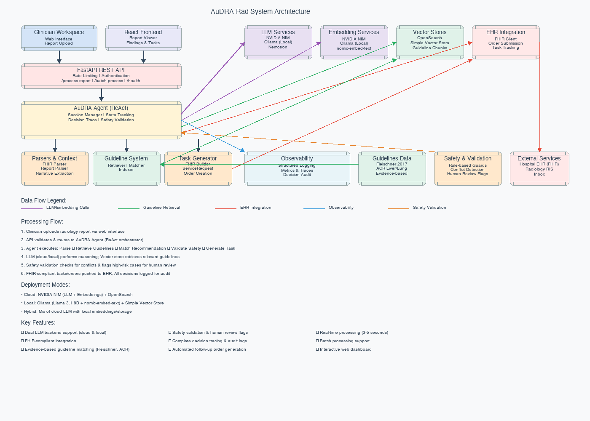

# AuDRA-Rad: Autonomous Radiology Follow-up Assistant

Closing the deadliest gap in radiology workflows by turning unstructured reports into tracked, guideline-backed care plans.

---

## Overview

AuDRA-Rad combines advanced language models (cloud-based or local via Ollama), retrieval-augmented generation (RAG), and FHIR-compliant integrations to extract critical findings, match the right guideline, and create follow-up orders inside the EHR. Hospitals can increase follow-up compliance, reduce liability, and deliver timely cancer care.

---

## Prerequisites

- Cloud provider account (AWS, Azure, GCP) or local setup with Docker
- Local tooling: `kubectl`, `docker`, `python3`
- LLM access: Either cloud-based API keys or Ollama for local deployment
- Optional: `terraform` or infrastructure-as-code tools for cloud deployments

---

## Quick Start

```bash
   # Clone repo
   git clone https://github.com/yourusername/audra-rad.git
   cd audra-rad
   
   # Setup environment
   cp .env.example .env
   # Edit .env with your credentials
   
   # Index guidelines locally
   docker-compose up -d  # Start local OpenSearch
   python scripts/index_guidelines.py --local
   python scripts/seed_sample_data.py --dry-run  # Preview demo payloads
   
   # Run locally
   uvicorn src.api.app:app --reload
   
   # Test
   curl -X POST http://localhost:8000/api/v1/process-report \
     -H "Content-Type: application/json" \
     -d @data/sample_reports/fhir_chest_ct_ggo.json
```

- The `.env` file stores LLM endpoints, API keys, and cloud credentials consumed by the RAG pipeline.
- Local OpenSearch runs via `docker-compose` with default ports (see `docker-compose.yml` for overrides).

---

## Environment Configuration

Populate `.env` (or your shell) with the values below before running the CLI helpers or API:

| Variable | Purpose | Required | Example |
| --- | --- | --- | --- |
| `ENVIRONMENT` | Controls logging format & env validation | always | `dev` |
| `LLM_ENDPOINT` | LLM API base URL (cloud or Ollama) | for LLM features | `https://api.openai.com/v1` or `http://localhost:11434` |
| `LLM_API_KEY` | API key for cloud LLM service | for cloud LLMs | `sk-...` |
| `EMBEDDING_ENDPOINT` | Embedding model base URL | for guideline indexing | Cloud or local endpoint |
| `EMBEDDING_API_KEY` | Embedding API key | for cloud embeddings | API key value |
| `OPENSEARCH_ENDPOINT` | OpenSearch endpoint URL | staging/prod or custom local port | `https://search-your-domain...` |
| `CLOUD_REGION` | Cloud region for services | staging/prod | `us-west-2` |

If `ENVIRONMENT` is set to `staging` or `prod`, the application enforces that all LLM and OpenSearch variables are present. For local development with `docker-compose`, you can leave `OPENSEARCH_ENDPOINT` unset to use `http://localhost:9200`.

---

## Cloud Deployment

1. **Confirm prerequisites**
   - Cloud CLI configured (AWS, Azure, or GCP)
   - `kubectl`, `helm`, and `docker` installed
   - Container registry access configured
2. **Provision infrastructure**
   - Create Kubernetes cluster
   - Configure IAM/RBAC roles, vector database, and container registry
   - Set up ingress and certificates for public endpoints
3. **Build and ship the container**
   - `docker build -t <registry>/audra-rad:<tag> .`
   - Authenticate with your container registry
   - `docker push` to registry
4. **Configure Kubernetes addons**
   - Install ingress controller, metrics server, and autoscaler
   - Apply GPU device plugins if using GPU nodes
5. **Deploy the application**
   - Apply secrets (`kubectl create secret generic audra-env --from-env-file=.env`)
   - Apply manifests in `deployment/kubernetes` (`kubectl apply -f deployment/kubernetes/`)
6. **Validate**
   - `kubectl get pods -n audra` ensures workloads are ready
   - `kubectl logs deploy/audra-api -n audra` checks application startup
   - Hit the ingress endpoint `/healthz` and `/docs`

**Budget tips:** Use autoscaling, pause non-production environments when idle, and monitor cloud costs regularly.

See `docs/DEPLOYMENT.md` for detailed deployment instructions and troubleshooting guidance.

---

## Architecture Diagram



- **Radiology ingestion**: FHIR-compatible parser normalizes raw reports into structured findings.
- **Guideline retrieval**: Vector database stores embedded medical guidelines indexed via the RAG pipeline.
- **Reasoning engine**: LLM service (cloud or Ollama) evaluates findings against the guideline corpus to generate recommendations.
- **Validation & safety**: Custom validators enforce guardrails, flag high-risk edge cases, and log decisions.
- **EHR integration**: FastAPI service exposes REST endpoints and pushes tasks/orders back to hospital systems.
- **Observability**: Structured logs and monitoring support operations at scale.

More system internals live in `docs/ARCHITECTURE.md`.

---

## API Documentation

- Interactive docs are available at `https://<your-domain>/docs` (FastAPI Swagger UI).
- Programmatic schema: `https://<your-domain>/openapi.json`.
- Refer to `docs/API.md` for request/response examples, status codes, and error dictionary.

Example requests:

```bash
curl -X POST https://<your-domain>/api/v1/process-report \
  -H "Authorization: Bearer $AUDRA_API_TOKEN" \
  -H "Content-Type: application/json" \
  -d @data/sample_reports/fhir_chest_ct_ggo.json

curl -X GET https://<your-domain>/api/v1/orders?status=pending \
  -H "Authorization: Bearer $AUDRA_API_TOKEN"
```

---

## Demo Video

[](demo_video.mp4)

The video walks through ingesting a real CT report, guideline retrieval with citations, autonomous EHR follow-up order creation, and clinician-facing alerts inside the dashboard.

---

## Examples

Check out the `examples/` directory for hands-on demonstrations:

### Ollama (Local LLM)
Run AuDRA-Rad with local Llama 3.1 8B via Ollama:
```bash
# Quick test
python examples/ollama/test_ollama_simple.py

# Full radiology analysis suite
python examples/ollama/test_radiology_analysis.py

# Interactive notebook
jupyter notebook examples/ollama/ollama_radiology_analysis.ipynb
```

See [`examples/ollama/README.md`](examples/ollama/README.md) for setup and detailed usage.

### MIMIC-IV Exploration
Analyze real-world radiology reports from MIMIC-IV:
```bash
jupyter notebook examples/mimic_exploration/explore_mimic_data.ipynb
```

See [`examples/mimic_exploration/README.md`](examples/mimic_exploration/README.md) for data access and analysis examples.

### Agent Demonstrations
Explore the original agent notebooks:
- [`notebooks/01_explore_reports.ipynb`](notebooks/01_explore_reports.ipynb) - Report exploration
- [`notebooks/02_test_retrieval.ipynb`](notebooks/02_test_retrieval.ipynb) - Guideline retrieval
- [`notebooks/03_agent_demo.ipynb`](notebooks/03_agent_demo.ipynb) - Full agent workflow

---

## Testing

```bash
pytest tests/ -v
./scripts/test_deployment.sh
```

- The deployment smoke test checks Kubernetes manifests, required secrets, and service readiness.
- Provide `NVIDIA_API_KEY` and `OPENSEARCH_URL` in your environment before running integration tests.

---

## CLI Utilities

- `scripts/index_guidelines.py` - chunk guideline markdown files, generate embeddings, and upsert vectors. Flags:
  - `--local` to force `http://localhost:9200`
  - `--drop-existing` to recreate the index
- `scripts/seed_sample_data.py` - generate demo ServiceRequests for the bundled sample DiagnosticReports. Defaults to the mock EHR; pass `--remote --ehr-base-url=https://your-ehr` to hit a live endpoint.

---

## Cost Management

- **Monitor usage**
  - `kubectl top nodes -n kube-system` (requires metrics-server)
  - Use cloud provider monitoring tools to track resource utilization
- **Pause infrastructure**
  - Scale down node groups when not in use
  - Pause or delete vector database collections during idle periods
- **Set alerts**
  - Create billing alarms in your cloud provider console
  - Enable budget notifications and spending alerts

Always clean up unused resources to avoid unnecessary charges.

---

## Troubleshooting

- **Image pull errors**: Authenticate with your container registry before `kubectl apply`. Ensure nodes have appropriate permissions to pull images.
- **Pods stuck in Init**: Check node availability and ensure required device plugins are running if using specialized hardware.
- **Vector database connection refused**: Verify network rules, correct endpoint URL in `.env`, and that the service is running.
- **Ingress 502/504**: Check ingress controller health, confirm FastAPI service responds at `/healthz`, and inspect `kubectl logs deploy/audra-api -n audra`.
- **View logs**: `kubectl logs -n audra deploy/audra-api -f` for application logs.

---

## License & Acknowledgments

- Licensed under the [MIT License](LICENSE).
- Built with support from the open radiology and medical AI community.
- Medical guideline content courtesy of the Fleischner Society, ACR, and broader evidence-based medicine contributors.

---

## Additional Resources

- `docs/ARCHITECTURE.md` - component deep dive, sequence diagrams, and data contracts
- `docs/DEPLOYMENT.md` - detailed deployment setup with configuration examples
- `data/guidelines/` - curated guideline corpus (Fleischner 2017, more coming)
- `tests/` - unit and integration tests covering parsers, validators, and end-to-end flows
