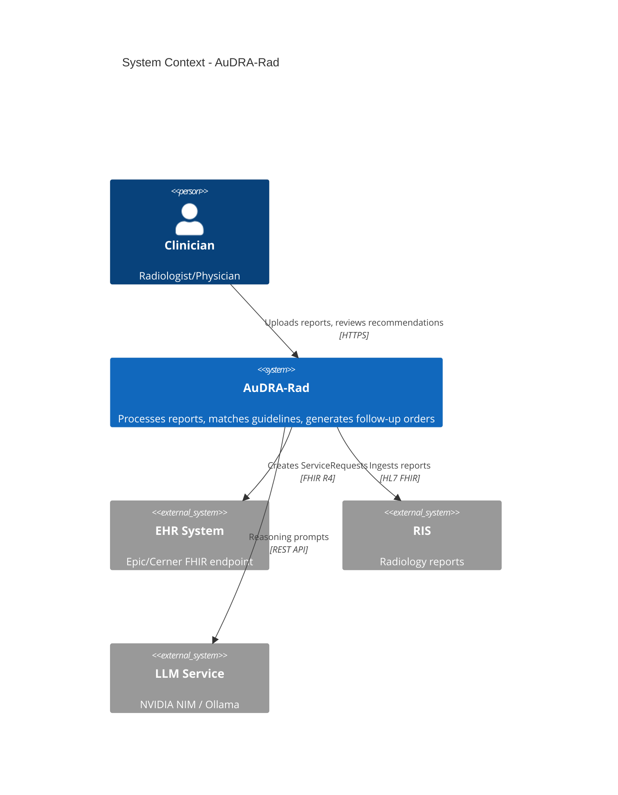
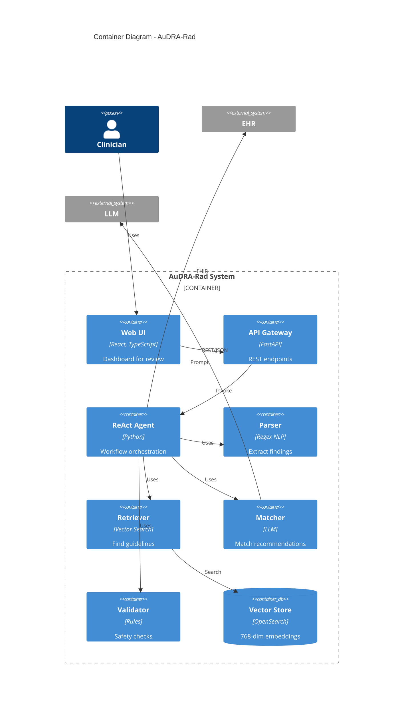
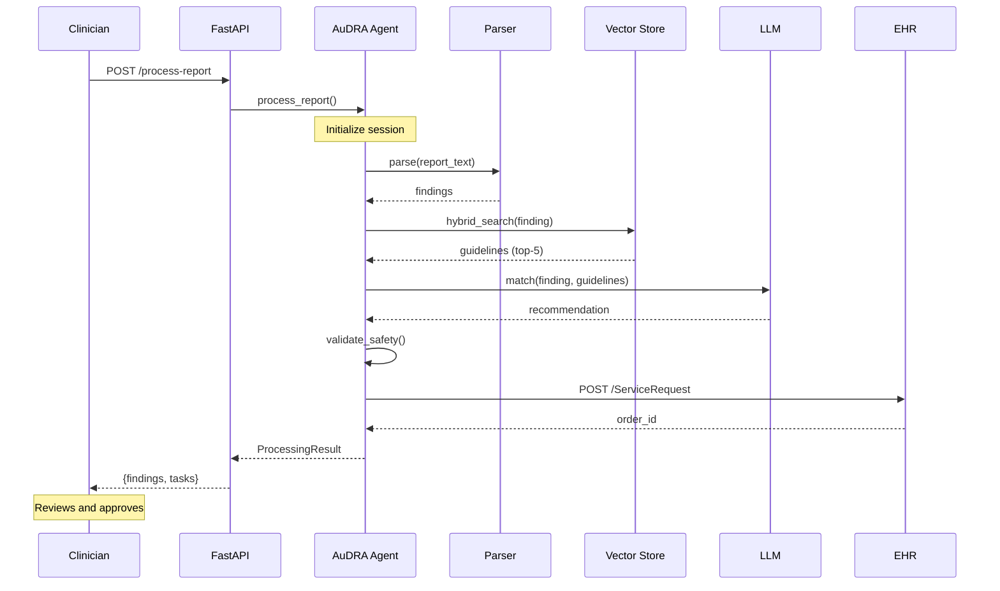

# AuDRA-Rad: System Architecture

**Version:** 1.0
**Last Updated:** 2025-01-16
**Purpose:** Comprehensive system architecture documentation using C4 Model

---

## Table of Contents

1. [System Overview](#system-overview)
2. [C4 Model Diagrams](#c4-model-diagrams)
3. [Core Architecture Patterns](#core-architecture-patterns)
4. [Technology Stack](#technology-stack)
5. [Deployment Options](#deployment-options)
6. [Security & Compliance](#security--compliance)

---

## System Overview

### Purpose
Automate evidence-based follow-up recommendations for radiology findings to prevent missed diagnoses.

**Problem:** 40-60% of actionable radiology findings lack documented follow-up.
**Solution:** AI-powered agent that parses reports → matches guidelines → generates EHR orders.

### Key Capabilities
- **Report Processing:** Extract structured findings from narrative reports (3-5 seconds)
- **Guideline Retrieval:** Semantic search over Fleischner 2017, ACR protocols (vector DB)
- **AI Reasoning:** LLM-based recommendation matching (NVIDIA NIM or local Ollama)
- **Safety Validation:** Rule-based checks, human review flags for high-risk cases
- **EHR Integration:** FHIR R4 ServiceRequest generation (Epic/Cerner compatible)

---

## C4 Model Diagrams

### Level 1: System Context



### Level 2: Container Architecture



### Critical Workflow: Report Processing



**Timing:** Parse (100ms) → Retrieve (500ms) → Match (2-4s) → Validate (50ms) → Generate (200ms) = **3-5s total**

---

## Core Architecture Patterns

### 1. ReAct Agent Pattern

**Design:** Reasoning + Acting workflow

```python
# Simplified flow
state, findings = parse_report_tool(state)
for finding in findings:
    state, guidelines = retrieve_guidelines_tool(state, finding)
    state, recommendation = match_recommendation_tool(state, finding, guidelines)
    state, is_safe = validate_safety_tool(state, recommendation)
    if is_safe:
        state, order_id = generate_task_tool(state, recommendation)
```

**Benefits:**
- Explainable (every decision logged)
- Modular (tools are independent)
- Extensible (add new tools easily)

### 2. Retrieval-Augmented Generation (RAG)

**Pipeline:**
1. **Query:** Build semantic query from finding ("3mm ground-glass nodule RUL")
2. **Embed:** Convert to 768-dim vector (NVEmbed / nomic-embed-text)
3. **Search:** kNN (cosine) + BM25 (keyword) → Reciprocal Rank Fusion
4. **Rerank:** Size/risk heuristics
5. **Reason:** LLM prompts with top-k guidelines → extract recommendation

**Advantages:**
- Evidence-based (citations to guidelines)
- Reduces hallucination
- Updatable (add guidelines without retraining)

### 3. Safety-First Design

**Validation Layers:**
```
Finding → Size check (>30mm?) → Characteristic check (spiculated?)
         → Urgency check → Citation check → Human review flag
```

**Example Triggers:**
- Lesion >30mm → Flag for review
- Spiculated/irregular → Flag for review
- Missing citation → Block automated order
- Urgent/stat recommendation → Flag for review

---

## Technology Stack

### Backend
- **Language:** Python 3.10+
- **API:** FastAPI (async ASGI), Uvicorn
- **Agent:** Custom ReAct implementation, Pydantic models
- **LLM (Cloud):** NVIDIA NIM (Nemotron-4 340B)
- **LLM (Local):** Ollama (Llama 3.1 8B)
- **Vector DB:** OpenSearch 2.x (HNSW index)
- **Embeddings:** NVEmbed-v2 / nomic-embed-text (768-dim)

### Frontend
- **Framework:** React 18 + TypeScript 5.x
- **Build:** Vite
- **Components:** Custom (findings list, task cards, citations)

### Infrastructure
| Component | Cloud (AWS) | Local |
|-----------|-------------|-------|
| **Compute** | EKS (Kubernetes) | Docker Compose |
| **LLM** | g5.4xlarge GPU | Ollama (CPU/GPU) |
| **Vector DB** | OpenSearch Serverless | Faiss / in-memory |
| **Cache** | ElastiCache Redis | Optional local Redis |

---

## Deployment Options

### Option 1: Cloud (AWS)

```
Internet → ALB (TLS) → EKS Cluster
                │
                ├─ API Pods (2-10 replicas, auto-scale)
                ├─ NIM LLM Pods (g5.4xlarge GPU)
                ├─ NIM Embed Pods (g5.xlarge GPU)
                │
                └─ OpenSearch Serverless
                └─ S3 (guidelines, audit logs)
```

**Cost:** ~$1,900/month (us-west-2)
**Performance:** <3s p50 latency, 50 reports/min
**Use Case:** Production, high throughput

### Option 2: Local (Ollama)

```
Local Machine:
  ├─ React Frontend (Vite dev)
  ├─ FastAPI API (port 8000)
  ├─ Ollama (Llama 3.1 8B, port 11434)
  ├─ Simple Vector Store (in-memory)
  └─ Mock EHR (FHIR simulator)
```

**Requirements:** 8+ CPU cores, 16GB RAM, optional GPU
**Performance:** 5-10s latency (CPU), 3-5s (GPU)
**Use Case:** Development, demos, privacy-sensitive

### Hybrid Deployment

**Setup:** Local LLM + Cloud vector store
**Benefits:** PHI stays on-premise, fast guideline updates

---

## Security & Compliance

### Authentication
- **API:** TLS 1.3, API key validation, JWT tokens (optional)
- **Rate Limiting:** 10 req/min (SlowAPI)
- **RBAC:** Clinician, Admin, System, Auditor roles

### Data Protection
- **At Rest:** AES-256 (databases, S3)
- **In Transit:** TLS 1.3, mTLS for EHR
- **PHI:** Scrubbed from logs, vector embeddings de-identified

### HIPAA Compliance
✅ Access controls, encryption, audit trails
✅ Data retention (7 years), Business Associate Agreements
🔄 Disaster recovery (RTO: 4h, RPO: 1h) - In Progress

### Audit Logging

Every decision is logged:
```json
{
  "session_id": "uuid",
  "step": "match_recommendation",
  "input": {"finding": {...}, "guidelines": [...]},
  "output": {"follow_up_type": "CT Chest", "timeframe": 6},
  "duration_ms": 2341,
  "user_id": "clinician-123"
}
```

---

## Key Design Decisions

| Decision | Rationale |
|----------|-----------|
| **ReAct Agent** | Explainable traces, modular tools |
| **Dual LLM Support** | Balance accuracy (cloud) + privacy (local) |
| **Hybrid Search** | Semantic + keyword = better recall |
| **FHIR R4** | EHR compatibility (Epic, Cerner) |
| **OpenSearch** | Hybrid search, AWS managed option |
| **FastAPI** | Async, auto docs, Pydantic validation |

---

## Performance Characteristics

- **Latency:** p50 <3s, p95 <5s, p99 <8s
- **Throughput:** 50 reports/min per cluster
- **Concurrency:** 100 concurrent requests per pod
- **Vector Search:** <500ms for top-5 (768-dim, 10k chunks)

---

## Related Documentation

- **[DEPLOYMENT.md](DEPLOYMENT.md)** - Detailed deployment guides
- **[diagrams/](diagrams/)** - PlantUML source files
- **[SYSTEM_DESIGN.md](SYSTEM_DESIGN.md)** - Deep technical dive
- **[README.md](../README.md)** - Quick start, examples

---

**Maintained by:** Architecture Team
**Review Frequency:** Quarterly
**Next Review:** 2025-04-16
